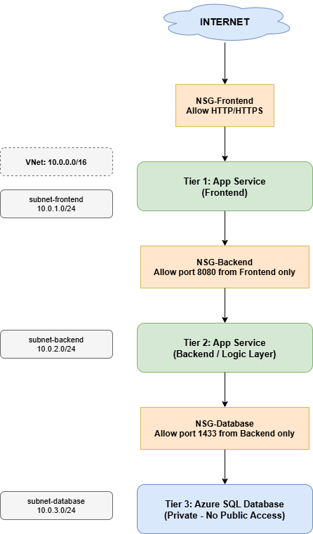

# Azure 3-Tier Architecture 

## Project Overview
A full 3-tier cloud architecture deployed on Microsoft Azure as part of my Cloud + AI learning journey.

## Architecture Diagram

## Live URL
https://app-3tier-kinjal-dwcaeeh8enetggha.italynorth-01.azurewebsites.net

## What is a 3-Tier Architecture?
A 3-tier architecture separates an application into 3 layers:
- **Tier 1 - Presentation:** What the user sees (frontend)
- **Tier 2 - Application:** The business logic layer (backend)
- **Tier 3 - Data:** The database layer (storage)

This separation means if one tier is compromised, the others remain protected.

## Services Used
| Service | Purpose |
|---|---|
| Azure App Service | Hosts the frontend and backend |
| Azure SQL Database | Stores application data |
| Azure Virtual Network | Isolates all resources in a private network |
| Network Security Groups | Controls traffic between tiers |
| Azure App Service Plan | Defines compute resources for App Service |

## Network Design
| Subnet | Address Range | Purpose |
|---|---|---|
| subnet-frontend | 10.0.1.0/24 | Hosts the frontend App Service |
| subnet-backend | 10.0.2.0/24 | Hosts the backend App Service |
| subnet-database | 10.0.3.0/24 | Hosts the Azure SQL Database |

## Security Design
| NSG | Rule | Why |
|---|---|---|
| nsg-frontend | Allow HTTP (80) and HTTPS (443) from internet | Users need to reach the website |
| nsg-backend | Allow port 8080 from frontend subnet only | Backend should never be public |
| nsg-database | Allow port 1433 from backend subnet only | Database is completely private |

## What I Learned
- How to design and deploy a 3-tier architecture on Azure
- How to secure traffic between tiers using Network Security Groups
- How to configure VNet subnets for network isolation
- How Azure App Service connects to backend databases securely
- How to troubleshoot Azure region restrictions on Student subscriptions

## Tools Used
- Azure Portal
- Azure CLI
- GitHub
- diagrams.net
- Kudu (Azure App Service debugging tool)

## Region
North Italy (Azure for Students subscription)

## Author
Kinjal Solanki | Dublin Business School
Cloud + AI Career Transition | Ireland 2026
